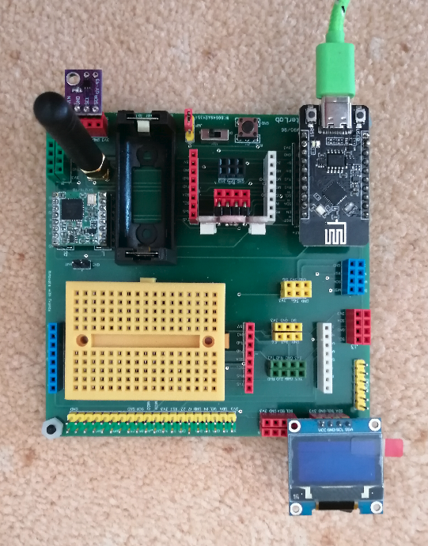
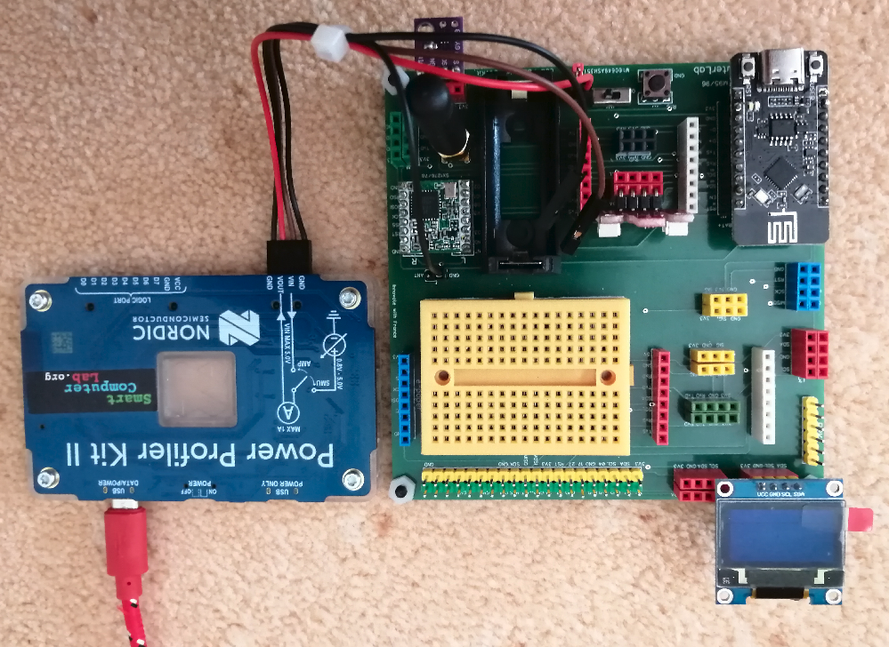
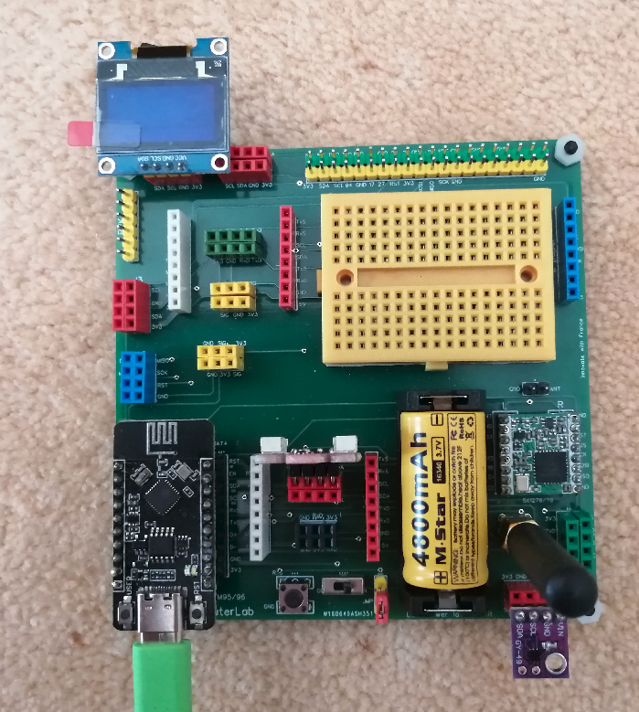
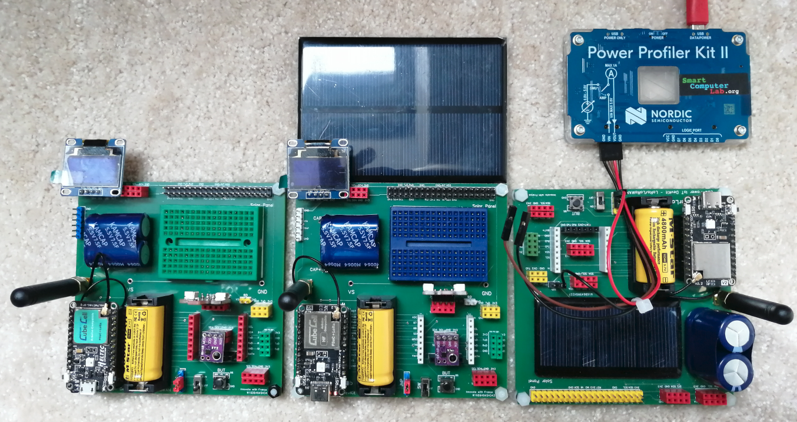

# GreenIT and IoT
The Internet of Things (IoT) encompasses the significant projected expansion of in-network utilization and node count. As a result, it is necessary to lower the resources required to implement all network parts and their energy. Energy consumption is becoming state-of-the-art to ensure the reliability of the Internet of Things and the deployment of an intelligent world. The IoT must be energy efficient to mitigate the greenhouse impact and carbon dioxide (CO2) emissions from sensors, devices, apps, and services to achieve a sustainable, innovative world.
In this context we are concerned by the applications related to the use and deployment of Low and Very Low Power IoT Architectures.
These low «power aspects» include the sensing, the processing, and the IoT data transmission operations. They may be attained via:

    1. The choice of power efficient sensors and sensing modes/cycles
    2. The selection of Ultra Low Processing units (ULP) often based on RISC-V processors.
    3. The reduction or “IoT data stream compression” to limit the transmission energy.

To work practically with low power aspects of IoT you need actual development kits based on low power IoT boards/SoCs.
Here, we provide you with two types of IoT boards based on RISC-V and ARM SoCs, namely ESP32C3 and ARM-M0.
The IoT DevKits integrate these boards and offer a large number of interfaces and autonomous power sources such as batteries, super-capacitors, and solar cells.

The first IoT DevKit integrates an ESP32C3 (RISC-V) SoC and several wireless links such as WiFi, BT, and LoRa for long range communication.
The same DevKit integrates an interface to Power Profiler Kit II to work in ammeter or source mode. In ammeter mode we use the integrated battery to analyze the current running from the battery to the board. In source mode , the PPK provides the energy source with the calibrated voltage.
The ESP32C3 SoC is integrated into IoT board produced by Heltec. To make the naming shorter we call this board in the prepared exercise as **HT** board.
IoT.CC.boards.energy.sources.png

The complete introduction to HT board and related DevKit and the prepared exercises is provided in the main document IoT.GreenIT.2024 (pdf).
## IoT DevKits - energy provision
### HT DevKit (HelTec)

  
  
  

The above HT DevKits are powered correspondigly by: USB from PC, Power Profiler source, battery source.

### CC DevKit (CubeCell)
The second IoT DevKit is based on ARM-SX1262 SoM (System on Module). It's power consumption in **low_power** stage is about **6µA**.
The board provides only Long Range communication link via LoRa modem (SX1262).
Three versions of the CC board are given below. 
There are several energy source available to run this board in an **autonomous way !**.
We hope that you can find them **by yourself !**

  

